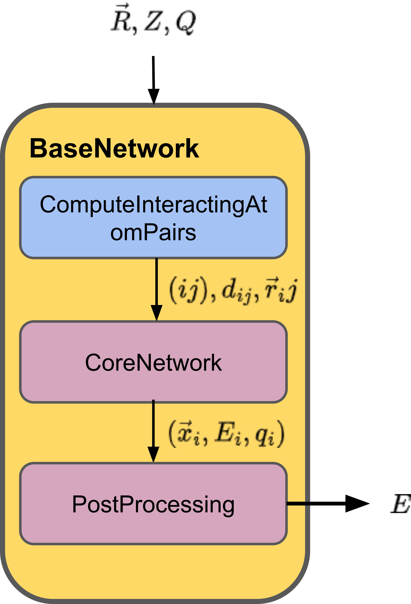
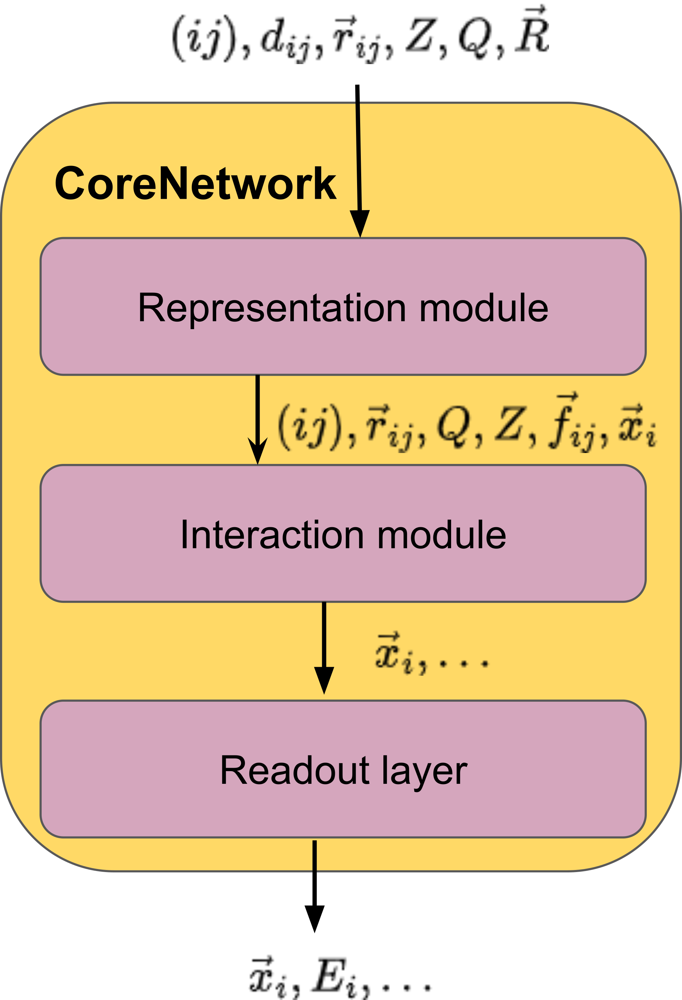

For Developers
===============

.. note::
    
        This section is intended for developers who want to extend the functionality of the `modelforge` package or who want to develop their own machine learned potentials. This section explains design decisions
        and the structure of neural network potentials.

How to deal with units
---------------------------------

All public APIs require explicit units for values that are not dimensionless.
The units are specified using the `openff.units` package, e.g.:

.. code-block:: python
    
        from openff.units import unit
    
        # A length of 1.0 angstrom
        length = 1.0 * unit.angstrom
    

Units are also provided in the TOML files. For example, the following TOML file specifies a maximum interaction radius of 5.1 angstrom:

.. code-block:: toml

        maximum_interaction_radius = "5.1 angstrom"

Internally, when units are removed, we use the openmm units system 
`here <http://docs.openmm.org/latest/userguide/theory/01_introduction.html#units/>`_.

Base structure of machine learned potentials
-------------------------------------------------

The base structure of machine-learned potentials is illustrated in the figure
below. This structure is implemented in the
:py:class:`~modelforge.potential.models.BaseNetwork` class class within the
:py:mod:`~modelforge.potential.models`` module. The
:py:class:`~modelforge.potential.models.BaseNetwork` class serves as a
comprehensive framework that encapsulates both the neighbor list calculation,
handled by the
:py:class:`~modelforge.potential.models.ComputeInteractingAtomPairs` class, and
the core neural network potential, represented by the
:py:class:`~modelforge.potential.models.CoreNetwork` class.

The neighbor list calculation is a critical component that determines which pairs of atoms in a molecular system are close enough to interact. This calculation not only identifies the interacting atom pairs but also computes the distances and distance vectors between each pair. These computed distances and vectors are essential for accurately modeling interatomic interactions in the neural network.

The :py:class:`~modelforge.potential.models.CoreNetwork` class is responsible for producing a variable number of scalar outputs, such as per-atom energies (`E_i``) and partial charges (`q_i``). Additionally, the :py:class:`~modelforge.potential.models.CoreNetwork` maintains and outputs a feature representation of the atoms before this representation is processed by the readout layers, which are specialized for each scalar property. The readout layers transform the intermediate atomic feature representations into the final properties of interest, such as energies or charges.

To further process these outputs, the :py:class:`~modelforge.potential.models.Postprocessing` class is used. This class performs several reduction operations, including summing the per-atom energies to compute the total molecular energy. The Postprocessing module may also perform other critical operations, such as calculating molecular self-energy corrections, which are necessary for accurate total energy predictions.

  
At a high level, as depicted in the figure below, the inputs to the core network include the following:

- **Pairwise atom indices (ij)**: These indices specify the atom pairs that interact.
- **Distances (d_ij)**: The scalar distance between each interacting atom pair.
- **Distance vectors (r_ij)**: The vector pointing from one atom in the pair to the other.
- **Atomic numbers (Z)**: The nuclear charge of each atom, which influences its chemical properties.
- **Total charge (Q)**: The net charge of the entire system, which can affect the electrostatic interactions.
- **Coordinates (R)**: The 3D spatial positions of the atoms.

The output of the core network includes the atomic energies (`E_i``) and the scalar feature representations of these energies before they undergo final processing through the readout layers. Additionally, the output can include other per-atom properties and associated scalar or vectorial feature representations, depending on the specific capabilities and configuration of the network.

The operations within the CoreNetwork are divided into two main modules:

- **Representation Module**: This module is responsible for embedding the atomic numbers and generating features from the 3D coordinates. It effectively translates the raw atomic inputs into a format that the neural network can process.

- **Interaction Module**: This module iteratively updates the atomic feature representations by learning from local, pairwise interactions between atoms. Over multiple iterations, the interaction module refines the atomic features to capture the complex dependencies between atoms in the molecular system.

These components work together to enable the accurate prediction of molecular properties from atomic and molecular inputs, forming the foundation of machine-learned potentials in computational chemistry and materials science.

Contributing to the modelforge package
---------------------------------------

The `modelforge` package is an open-source project, and we welcome contributions from the community.
In general, modelforge uses the `Fork & Pull <https://docs.github.com/en/pull-requests/collaborating-with-pull-requests/getting-started/about-collaborative-development-models#>`_ approach for contributions; any github users can fork the project and submit a pull request with their changes.
The modelforge team will review the pull request and merge it if it meets the project's standards.
*modelforge* follows the `PEP8 <https://pep8.org/>`_ style guide for Python code and uses `black <https://black.readthedocs.io/en/stable/>`_ for code formatting, with a default maximum line length of 88 characters.
Python type hints are also used to improve code readability and maintainability.
Docstrings are included and formatted using the `numpydoc <https://numpydoc.readthedocs.io/en/latest/>`_ style.
